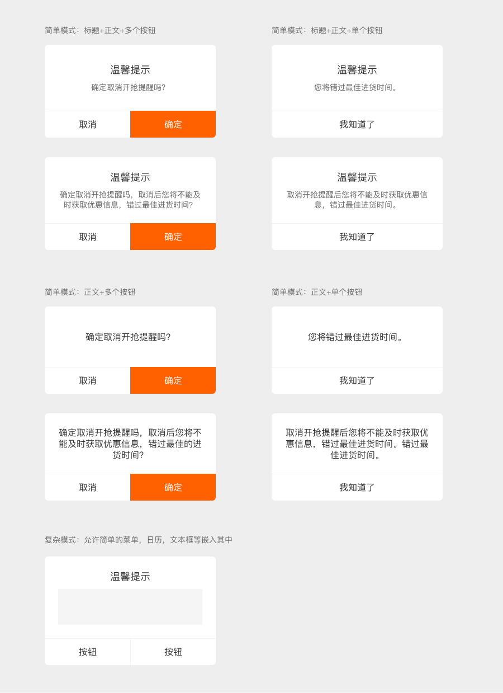
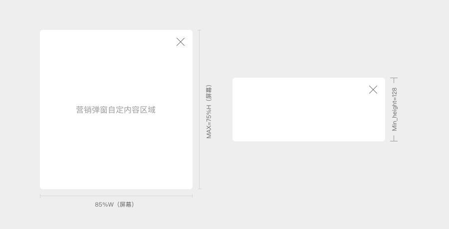
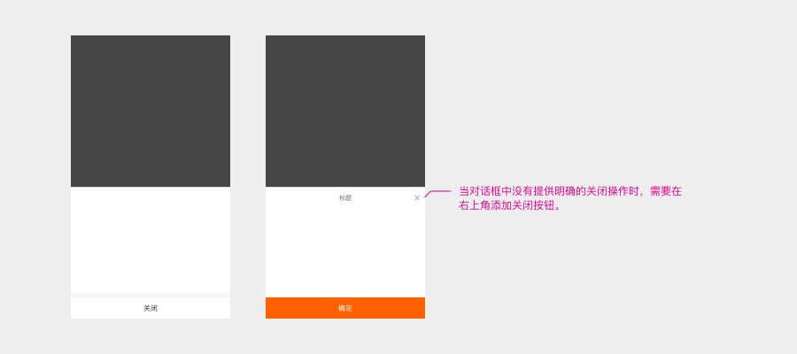
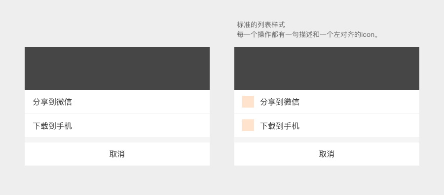
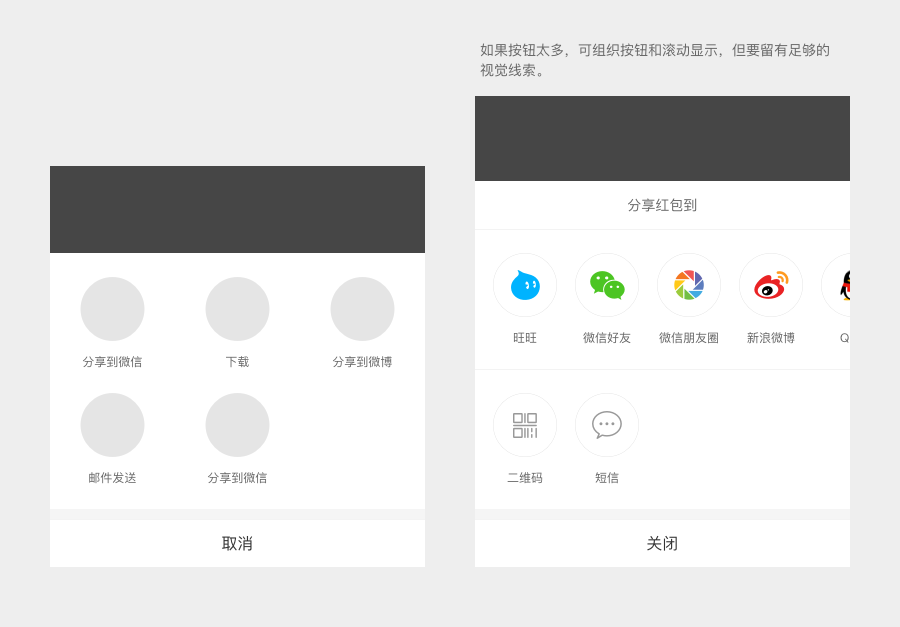
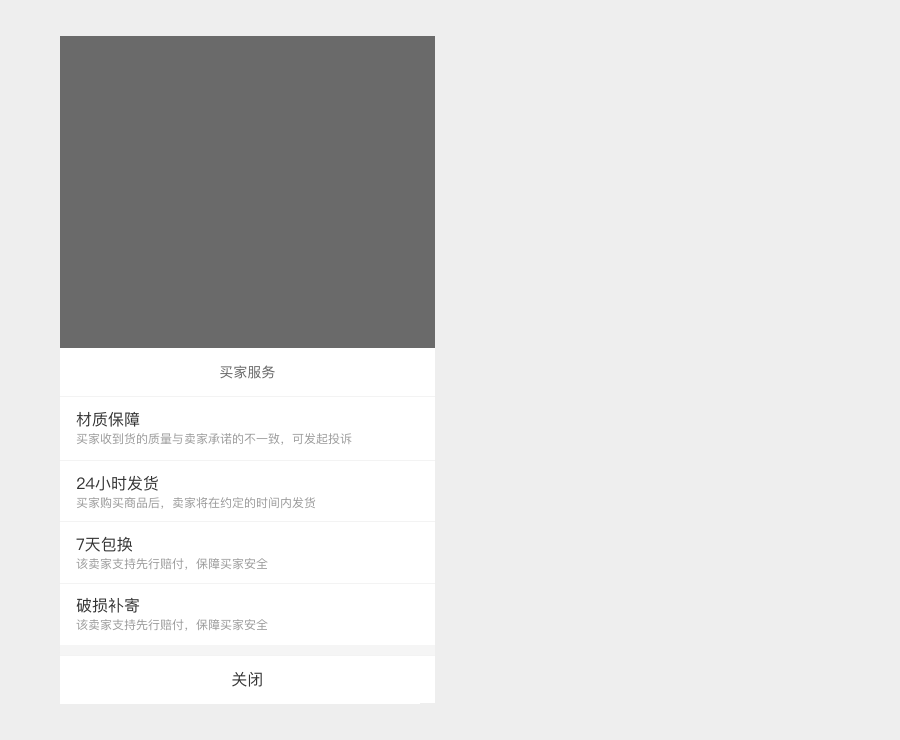
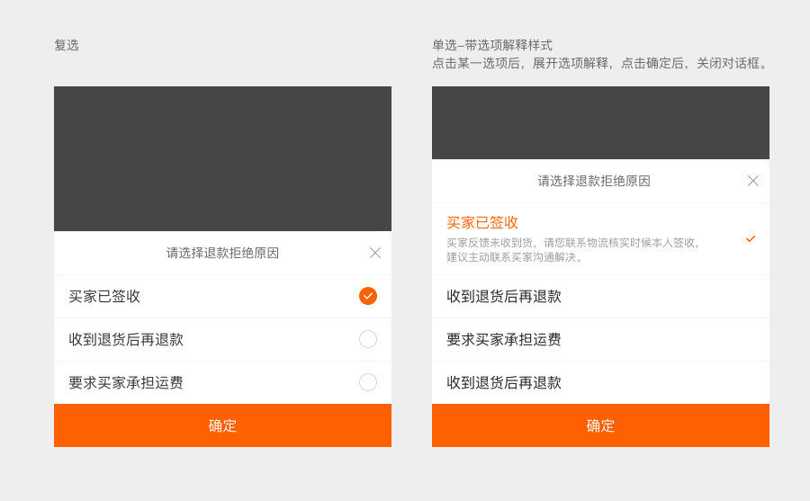
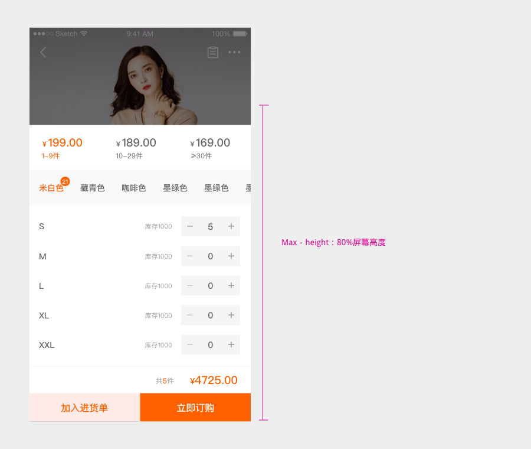

# Dialog 对话框

## 定义 / Definition

对话框是一种特殊的视窗, 用来为一个操作提供警告和简单的确认，也可能包括程序终止或崩溃的提示，以及容纳一些中断性的任务。弹出框在应用屏幕的中间弹出并且位于所有其他视图的上方，向用户提供影响它们使用应用（或设备）的重要信息。

## 规则／Rule

在设计时，什么时候使用弹框还是页面来承载内容？可以根据弹框的特性做出选择：

· 较页面轻，可以更快的回到之前的页面

· 相对独立，可以完全不影响页面的布局

· 适合解决简单，一次性的操作。

## 样式与交互 / Style&Interaction

### 1. 提示弹框

提示弹框（Dialog）包含标题\(可选\)，内容（要提供给用户足够决策的信息，不要用长句、歧义等文案），事件。

### 使用场景：

提示弹框用于展示确认或者警示信息。会打断用户的操作，要求用户集中精力来处理其传达的信息，并需要一次点击才能结束，因此要让用户明确知道警告框出现的合理性和必要性。

### 使用规则：

提示是最基础的弹框应用，设计时需保持统一性。

通常将否定操作放在左边，主要操作如（确定操作）放在右边。

使用两个按钮的提示框时，按钮名称最好明确告知操作后果的文字，如保存，删除，转账等，而不是确定。

### 2. 营销弹窗

### 使用场景：

用于强调视觉表现的场景中，如大促、新手指南、任务引导等。

### 使用规则：

弹窗必须有关闭按钮。

弹窗有最大高度和最小高度。

设计时不用局限在方框内，可以使用破形。

在规定的尺寸范围内设计师在遵循1688APP基础样式的风格指南上可根据业务的品牌调性自由发挥。

### 3. 半屏对话框

### 使用场景：

可以承载比较多的信息内容，同时可以保留一些操作一直停留在屏幕上，但在使用时尽量避免出现滚动条。

抽象了4种常见场景 - 更多动作菜单，展示信息，填写表单（单选、复选），复杂。

### 使用规则：

动效为唤起-对话框从屏幕的底部边缘向上浮动，用户初始的内容自然变暗。

关闭-点击阴影区域（或者关闭X）关闭对话框，对话框快速向下滑动出去。

当对话框中没有提供明确的关闭操作时，需要在右上角添加关闭按钮。

a. 动作列表／Actionsheet

b. 信息展示

c. 填写表单

d. 复杂－可自定义

