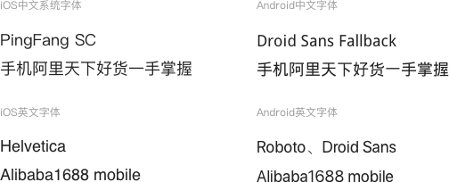
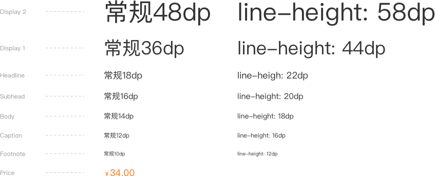
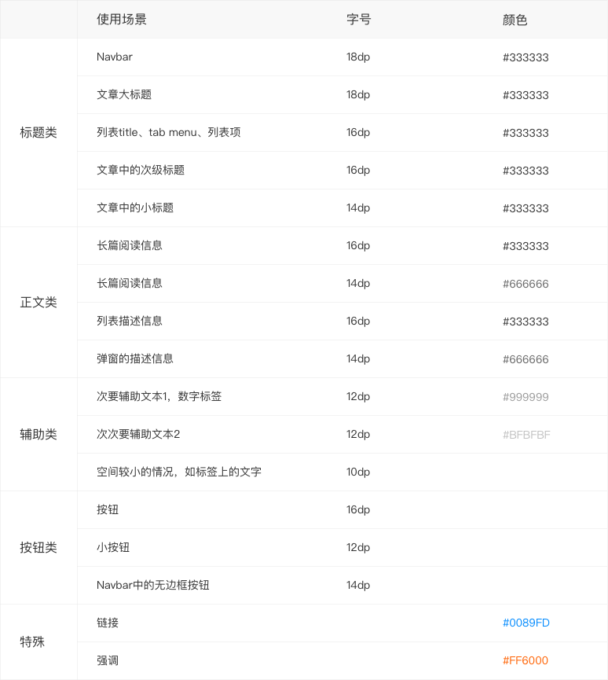
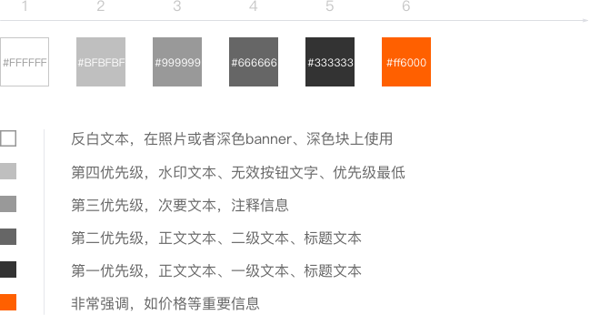

# Font 字体

## 定义 / Definition

设定字体主要解决的是内容可读性以及信息的层级表达，同时选择不同的字体来传达不同的设计风格的统一性和整体性，从而在阅读的舒适性上达到平衡。

## 选择字体 / Choose Fonts

## 字号／Font Size

选择不同的字号来表达文本信息的层级。通常使用 24、28、32、36号字体来完成文本编排。考虑识别度方面小于10号以下的字号将不使用。这里列举了常规情况下碰到文本信息格式的对应字号，具体的表达参考如下：

特殊情况：当文本超过3行，以大段阅读性文章排布，文字的行距可为字号的1.6倍。

## 1688Mobile 常用字体表

## 字体使用样例／Sample

混合信息编排中的运用样例

辅助文本的运用样例

标签tag上的运用样例

## 字的颜色层级

建立文字的层次，可以创造出秩序。注重负空间的运用。

1688主客文字层次一般有：主要、次要（用户沉浸阅读的时候用）、再次、其他。

我们通常使用对比的手法来区分出信息的层次感，信息主次分明能准确地将信息清晰地传达给用户，让用户第一眼获取所需信息，提升阅读体验。

