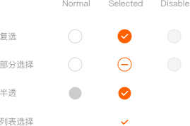
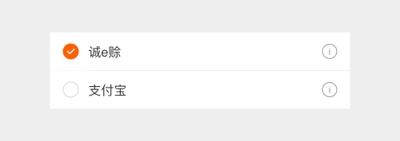
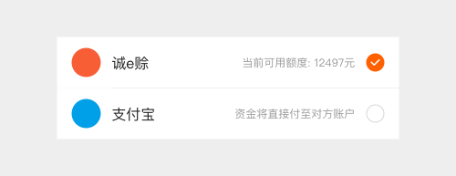
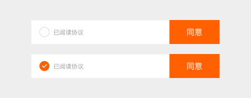
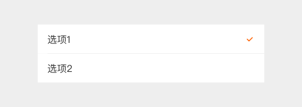
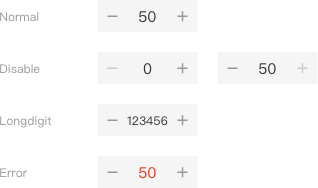

# Selector 选择控制器

## 定义 / Definition

选择控制器允许用户选择选项。有三种类型：复选框、单选框、数量步进器以及开/关切换。选择控制器使用主题同样的颜色。

### 1. 单复选框

复选框允许用户从一个数据集中选择多个选项。

如果在一个列表中有多个选项，你可以通过使用复选框而不是开/关切换来节省空间。

如果你有一个单选项，不要用复选框，使用开/关切换。

### 样例分析

当列表本身具有详情页的交互属性时（如点击新页面展开），单选出现在左侧。

当列表只有选择功能时，单选出现在右侧。

协议勾选框

单选图片的样式

列表菜单选择

单选按钮允许用户从一个数据集中选择单个选项。如果你觉得用户需要并排看到所有的可选项，使用单选按钮进行排他操作。此外，考虑使用下拉列表，相对于显示所有的选项占用更少的空间。

### 2. 数量步进器

在提供规定数值当中进行单一选择并提供加减的操作。通常情况会嵌入在表单的操作当中，交互内容可以根据环境不同而变化。

### 3. 滑块

滑块控件\(Sliders，简称滑块\)可以让我们通过在连续或间断的区间内滑动锚点来选择一个合适的数值。区间最小值放在左边，对应的，最大值放在右边。滑块\(Sliders\)可以在滑动条的左右两端设定图标来反映数值的强度。这种交互特性使得它在设置诸如音量、亮度、色彩饱和度等需要反映强度等级的选项时成为一种极好的选择。

### 3.1. 连续滑块

在不要求精准、以主观感觉为主的设置中使用连续滑块，让使用者做出更有意义的调整。

### 3.2. 滑块选择器

滑块选择器可以让我们通过在连续或间断的区间内滑动锚点来选择一个合适的数值。区间最小值放在左边，对应的，最大值放在右边。

滑块\(Sliders\)可以在滑动条的左右两端设定图标来反映数值的强度。

带有可区间选择数值的滑块

### 4. 切换开关

开/关切换器切换单个设置选项的状态。开关控制器中的选项，以及它所在的状态，应该用伴随的内联标签显示清楚。开关选择器具有和单选按钮一样的视觉属性。使用文本“开”和“关”滑动切换已经过时了。使用这里显示的开关选择器代替。

