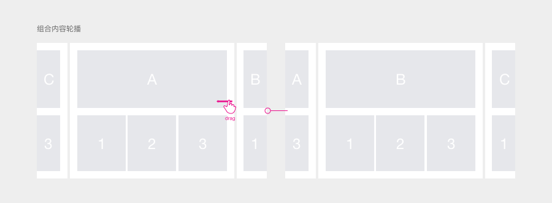

# Slider 轮播

## 定义 / Definition

在一个模块内需要依次展现多图或多组对象时，常用到轮播模块。

## 分类 / Type

1、吸附型

2、跟随型

## 样式与交互 / Style&Interaction

### 吸附型

轮播时，每一张或每一组图片都固定停留位置。

### 1、单图展示

图片数量：轮播图片数量建议不超过8张。

锚点提示

轮播逻辑：可手动轮播，必要时也可自动轮播（时间间隔为 3秒 一组图片），轮播到最后一张图后回到第一组图。

轮播暗示：圆形锚点暗示可切换内容。

预露内容

轮播逻辑：可手动轮播，必要时也可自动轮播（时间间隔为 3秒 一组图片），轮播到最后一张图后回到第一组图。

轮播暗示：预露出下组内容暗示有更多内容可切换。

### 2. 多图展示

图片数量：一屏内完整展示的图片建议不超过3张。

锚点提示

轮播逻辑：整组切换，可手动操作，必要时也可自动轮播（时间间隔为3秒 一组图片），轮播到最后一张图后回到第一组图。

轮播暗示：圆形锚点暗示可切换内容。

预露内容

轮播逻辑：根据滑动力度判断滑动距离（具体情况由设计决定可参考app store），仅支持手动轮播，拖动至最后一张图时完整展示最后一张。

轮播暗示：预露出下组内容暗示有更多内容可切换。

### 跟随型

进行切换操作时，滑动到哪停留到哪，无固定停留位置。

